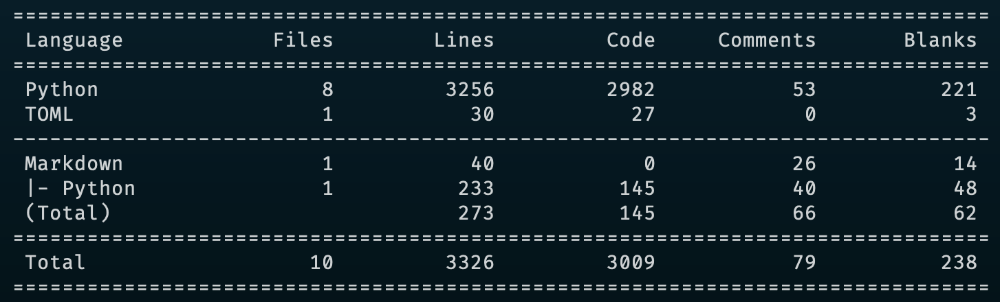

# DhanHQ-Ticker-py
The Unofficial Python Websocket Client For Communicating With The [Dhan API](https://api.dhan.co)

DhanHQ-Ticker-py is a set of Websocket API that expose many capabilities required to build a complete investment and trading platform. Stream extended set of realtime market datas s well as order updates and more.


## Quickstart
You can install the package via `pip install -U git+https://github.com/Indian-Algorithmic-Trading-Community/DhanHQ-Ticker-py.git` or `pip install dhanhq_ticker_py-0.1.0-py3-none-any.whl`

**Note:** _As Mentioned in this [tweet](https://x.com/xoreax_eaxeax/status/1731551257301839966) the two key files `src/dhanhq_ticker_py/ticker.py` and `src/dhanhq_ticker_py/utils.py` and the wheel file has not been uploaded here on purpose. Refer the screenshots for more info._

### WebSocket Usage

*Example -1 =>*  [login_with_credentials_ticker.py](https://github.com/Indian-Algorithmic-Trading-Community/DhanHQ-Ticker-py/blob/main/examples/login_with_credentials_ticker.py)

```python
import signal
from time import sleep
from dhanhq_ticker_py import (
    DhanTicker,
    get_option_chain,
    get_expiry_dates,
    get_instruments_details,
)

login_id = "Paste Your User User Id / Login Id Here"
password = "Paste Your User Password Here"
# Or You Can Read From A Plain Text File / Config / TOML / YAML Files.

# Define The Callbacks / Method Hooks
def on_ticks(tick):
    print(tick, end="\n" * 2)

def on_order_update(order_update):
    print(order_update, end="\n" * 2)

# Assign The Callbacks / Method Hooks
callbacks = DhanTicker.default_callbacks()
callbacks.update({"on_tick": on_ticks, "on_order_update": on_order_update})

ticker = DhanTicker(
    callbacks=callbacks,
    # debug=False, # Uncomment This For Debugging
    # debug_verbose=False, # Uncomment This For Verbose Debugging
)

ticker.login_with_credentials(login_id, password)

# As Dhan Doesn't Offer Provisions To Use TOTP, Instead It Send OTP On
# The Registered Mobile Number And Email ID. The Program Will Wait For
# The User To Key In The Received OTP In The Terminal / Console And Press
# Enter To Continue Completing A Successfull Login With Credentials.

# Fetch Instrument Details For Which We Want To Subscribe For Market Data
bnf_expiry, nf_expiry = [get_expiry_dates(idx, "NSE") for idx in {"BANKNIFTY", "NIFTY"}]
nearest_bnf_expiry, nearest_nf_expiry = (
    bnf_expiry["ExpiryDate"][0],
    nf_expiry["ExpiryDate"][0],
)

instruments = get_instruments_details(
    ["NIFTY", "BANKNIFTY"],
    "NSE",
    is_optidx=True,
    expiry_dates=[nearest_bnf_expiry, nearest_nf_expiry],
    strikes=[20000, 45000],
    opt_types=["CE", "PE"],
)
finnifty_all_nearest_expiry_options = get_option_chain("FINNIFTY", "NSE")

# Subscribe / Unsubscribe To The Instruments, It Can Be At Any Point
# After Instantiation of `DhanTicker` Class Object With Either `userdata`
# Or Login With Credentials.

# There Are Only Two Modes, Quote Mode and Full Mode.

if instruments is not None:
    ticker.subscribe(instruments, mode=ticker.FULL)
ticker.subscribe(finnifty_all_nearest_expiry_options, mode=ticker.FULL)

# The Ticker is fully asynchronous and runs in a background thread event loop.
# So We Need To Keep The Main Thread Alive.

if __name__ == "__main__":
    signal.signal(signal.SIGINT, ticker._handle_stop_signals)
    signal.signal(signal.SIGTERM, ticker._handle_stop_signals)

    while True:
        try:
            # Do Any Operation In This Thread, And It Won't
            # Effect The Market Data Feed And Order Update Feed.

            # Or If You do not want to do any operation but only
            # want the updateds to keep printing in the console /
            # terminal, then print anything or put `pass` in this
            # block and keep the rest lines as is.

            print("Dr June Moone Say's Hi! From Main Thread")
        except KeyboardInterrupt:
            break
        else:
            sleep(5)
```

*Example - 2 =>*  [login_with_userdata_ticker.py](https://github.com/Indian-Algorithmic-Trading-Community/DhanHQ-Ticker-py/blob/main/examples/login_with_userdata_ticker.py)

```python
import signal
from time import sleep
from dhanhq_ticker_py import (
    DhanTicker,
    get_option_chain,
    get_expiry_dates,
    get_instruments_details,
)

userdata = "Paste Your User Data Here"
# Or You Can Read From A Plain Text File / Config / TOML / YAML Files.

# Define The Callbacks / Method Hooks
def on_ticks(tick):
    print(tick, end="\n" * 2)

def on_order_update(order_update):
    print(order_update, end="\n" * 2)

# Assign The Callbacks / Method Hooks
callbacks = DhanTicker.default_callbacks()
callbacks.update({"on_tick": on_ticks, "on_order_update": on_order_update})

ticker = DhanTicker(
    userdata=userdata,
    callbacks=callbacks,
    # debug=False, # Uncomment This For Debugging
    # debug_verbose=False, # Uncomment This For Verbose Debugging
)

# Fetch Instrument Details For Which We Want To Subscribe For Market Data
bnf_expiry, nf_expiry = [get_expiry_dates(idx, "NSE") for idx in {"BANKNIFTY", "NIFTY"}]
nearest_bnf_expiry, nearest_nf_expiry = (
    bnf_expiry["ExpiryDate"][0],
    nf_expiry["ExpiryDate"][0],
)

instruments = get_instruments_details(
    ["NIFTY", "BANKNIFTY"],
    "NSE",
    is_optidx=True,
    expiry_dates=[nearest_bnf_expiry, nearest_nf_expiry],
    strikes=[20000, 45000],
    opt_types=["CE", "PE"],
)
finnifty_all_nearest_expiry_options = get_option_chain("FINNIFTY", "NSE")

# Subscribe / Unsubscribe To The Instruments, It Can Be At Any Point
# After Instantiation of `DhanTicker` Class Object With Either `userdata`
# Or Login With Credentials.

# There Are Only Two Modes, Quote Mode and Full Mode.

if instruments is not None:
    ticker.subscribe(instruments, mode=ticker.FULL)
ticker.subscribe(finnifty_all_nearest_expiry_options, mode=ticker.FULL)

# The Ticker is fully asynchronous and runs in a background thread event loop.
# So We Need To Keep The Main Thread Alive.

if __name__ == "__main__":
    signal.signal(signal.SIGINT, ticker._handle_stop_signals)
    signal.signal(signal.SIGTERM, ticker._handle_stop_signals)

    while True:
        try:
            # Do Any Operation In This Thread, And It Won't
            # Effect The Market Data Feed And Order Update Feed.

            # Or If You do not want to do any operation but only
            # want the updateds to keep printing in the console /
            # terminal, then print anything or put `pass` in this
            # block and keep the rest lines as is.

            print("Dr June Moone Say's Hi! From Main Thread")
        except KeyboardInterrupt:
            break
        else:
            sleep(5)
```

*Example - 2 =>*  [get_instrument_details.py](https://github.com/Indian-Algorithmic-Trading-Community/DhanHQ-Ticker-py/blob/main/examples/get_instrument_details.py)

```python
from dhanhq_ticker_py import (
    get_option_chain,
    get_expiry_dates,
    get_instrument_details,
    get_instruments_details,
    fetch_and_save_latest_dhan_master_scrip_feather,
)

fetch_and_save_latest_dhan_master_scrip_feather()

get_instrument_details("RELIANCE", "BSE", is_equity=True, pretty_print=True)

get_instrument_details(
    "USDINR",
    "BSE",
    is_optcur=True,
    expiry_date="2023-12-08",
    strike=82.5,
    opt_type="CE",
    pretty_print=True,
)

get_instruments_details(
    ["RELIANCE", "HDFCBANK"], "BSE", is_equity=True, pretty_print=True
)

get_instruments_details(["SENSEX", "BANKEX"], "BSE", is_index=True, pretty_print=True)

get_instruments_details(
    ["NIFTY", "BANKNIFTY", "FINNNIFTY", "MIDCPNIFTY"],
    "NSE",
    is_index=True,
    pretty_print=True,
)

print(get_expiry_dates("NIFTY", "NSE"))

print(get_option_chain("NIFTY", "NSE"))
print(get_option_chain("NIFTY", "NSE", "2023-12-14"))

print(get_expiry_dates("BANKNIFTY", "NSE"))

print(get_option_chain("BANKNIFTY", "NSE"))
print(get_option_chain("BANKNIFTY", "NSE", "2023-12-13"))


bnf_expiry, nf_expiry = [get_expiry_dates(idx, "NSE") for idx in {"BANKNIFTY", "NIFTY"}]

print(bnf_expiry, nf_expiry, sep="\n" * 2, end="\n" * 2)

nearest_bnf_expiry, nearest_nf_expiry = (
    bnf_expiry["ExpiryDate"][0],
    nf_expiry["ExpiryDate"][0],
)
print(nearest_bnf_expiry, nearest_nf_expiry, sep="\n" * 2, end="\n" * 2)

instruments = get_instruments_details(
    ["NIFTY", "BANKNIFTY"],
    "NSE",
    is_optidx=True,
    expiry_dates=[nearest_bnf_expiry, nearest_nf_expiry],
    strikes=[20000, 45000],
    opt_types=["CE", "PE"],
)
print(instruments, end="\n" * 2)

finnifty_all_nearest_expiry_options = get_option_chain("FINNIFTY", "NSE")
print(finnifty_all_nearest_expiry_options, end="\n" * 2)
```

### Code Statistics


#### License
<sup>
Licensed under either of <a href="LICENSE-APACHE">Apache License, Version
2.0</a> or <a href="LICENSE-MIT">MIT license</a> at your option.
</sup>

<br>

<sub>
Unless you explicitly state otherwise, any contribution intent
